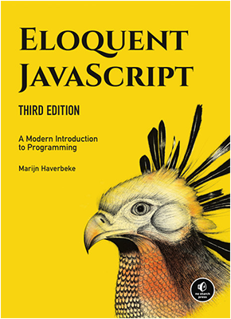

  

<h1 align="center">Eloquent JavaScript</h1>

A Modern Introduction to Programming

## Book Description

Eloquent JavaScript dives into the JavaScript language to show programmers how to write elegant, effective JavaScript code.

## About the Author

Marijn Haverbeke is a programming language enthusiast and polyglot. He's worked on a wide range of software systems, from databases to compilers to editors. He runs a small business around his open source projects.

## Exercises

Chapter 01 (This chapter has no exercises)
[Chapter 02](./chapter_02)
[Chapter 03](./chapter_03)
[Chapter 04](./chapter_04)
[Chapter 05](./chapter_05)
[Chapter 06](./chapter_06)
[Chapter 07](./chapter_07)
[Chapter 08](./chapter_08)
[Chapter 09](./chapter_09)
[Chapter 10](./chapter_10)
[Chapter 11](./chapter_11)
[Chapter 12](./chapter_12)
